# 🤖 Multi-Agent Data Science OS

<div align="center">

**An Agentic AI System for Automated Data Science & Machine Learning Pipelines**

_Powered by Agno Framework_

[](https://www.python.org/downloads/)
[](https://fastapi.tiangolo.com/)
[](LICENSE)

[Features](#-features) • [Installation](#%EF%B8%8F-installation) • [Usage](#-usage) • [Architecture](#-architecture) • [Tech Stack](#-tech-stack)

</div>

---

## 📖 Overview

This project is a **production-ready multi-agent system** built using the **Agno framework** that automates end-to-end Data Science and Machine Learning workflows. Think of it as a **mini AI workplace** where specialized agents collaborate to solve complex data science tasks through natural language instructions.

### 🎯 What Makes This Special?

Instead of writing hundreds of lines of code for data analysis, model training, and visualization, you simply describe what you need. The system intelligently delegates tasks to specialized agents who work together to deliver results.

---

## ✨ Features

### 🧠 Multi-Agent Architecture

Each agent is a specialist with a defined role:

| Agent                  | Role           | Capabilities                         |
| ---------------------- | -------------- | ------------------------------------ |
| **Team Leader**        | Orchestrator   | Delegates tasks and manages workflow |
| **Data Loader**        | Data Ingestion | Reads CSV files using CSV tools      |
| **Data Understanding** | EDA Specialist | Performs exploratory data analysis   |
| **Visualization**      | Chart Creator  | Generates plots via matplotlib       |
| **Coding Agent**       | ML Engineer    | Writes and executes Python/ML code   |
| **File Manager**       | System Admin   | Manages project filesystem           |
| **Shell Agent**        | Operations     | Executes controlled shell commands   |

### 🔌 AgentOS Integration

- **Persistent Memory**: Maintains context across conversations
- **History Tracking**: Remembers previous interactions
- **Team Orchestration**: Automatically coordinates multi-agent workflows

### 📦 Powerful Tooling

The system includes comprehensive tools for:

- **CsvTools** - Safe CSV file operations
- **PandasTools** - Advanced data manipulation
- **VisualizationTools** - Statistical plotting
- **PythonTools** - Code execution environment
- **ShellTools** - System operations
- **DuckDuckGoTools** - Web search capabilities

### 🌐 FastAPI Backend

Complete REST API for integration with:

- Web applications
- Interactive dashboards
- Automation pipelines
- AI-powered products

---

## 🏗 Architecture

```mermaid
flowchart TD
    A[👤 User] --> B[🌐 AgentOS API]

    B --> C[👔 Team Leader Agent]

    C --> D1[📥 Data Loader Agent]
    C --> D2[📊 Data Understanding Agent]
    C --> D3[📈 Visualization Agent]
    C --> D4[💻 Coding Agent]
    C --> D5[🗂 File Manager Agent]
    C --> D6[⚡ Shell Agent]

    D1 -->|Reads CSV| E[(📁 Data Files)]
    D4 -->|Executes Code| F[(🐍 Python Scripts)]
    D3 -->|Saves Plots| G[(📊 plots/ folder)]
```



---

## 📁 Project Structure

```
multi-agent-ds-os/
│
├── data/                      # Dataset storage
│   └── car_details.csv        # Example dataset
│
├── plots/                     # Generated visualizations
│
├── memory.db                  # Persistent agent memory
│
├── app.py                     # FastAPI application
├── requirements.txt           # Python dependencies
├── .env.example              # Environment template
├── README.md                 # Documentation
└── LICENSE                   # License file
```

---

## ⚙️ Installation

### Prerequisites

- Python 3.8 or higher
- pip package manager
- Git

### Setup Steps

```bash
# 1. Clone the repository
git clone https://github.com/brij26/data_science_team.git
cd data_science_team

# 2. Create a virtual environment (recommended)
python -m venv venv
source venv/bin/activate  # On Windows: venv\Scripts\activate

# 3. Install dependencies
pip install -r requirements.txt

# 4. Configure environment variables
cp .env.example .env
# Edit .env and add your API keys

# 5. Run the application
python app.py
```

The API will be available at `http://localhost:7777`

---

## 🚀 Usage

### Starting the Server

```bash
python app.py
```

Visit `http://localhost:7777/docs` for interactive API documentation.

### Example Workflows

#### 1. **Load and Explore Data**

```
User: "Load the car_details.csv file and show me the numerical columns."
```

**Agent Workflow:**

1. Team Leader → Delegates to Data Loader Agent
2. Data Loader → Reads CSV file
3. Data Understanding Agent → Identifies column types
4. Returns structured summary

#### 2. **Generate Visualizations**

```
User: "Create a histogram of car prices and save it to the plots folder."
```

**Agent Workflow:**

1. Team Leader → Coordinates task
2. Data Understanding → Identifies price column
3. Visualization Agent → Creates histogram
4. File Manager → Saves to plots/

#### 3. **Build ML Models**

```
User: "Train a linear regression model to predict car prices based on mileage and year."
```

**Agent Workflow:**

1. Team Leader → Plans ML pipeline
2. Data Understanding → Prepares features
3. Coding Agent → Writes training code
4. Coding Agent → Executes and evaluates model

---

## 🛠 Tech Stack

| Component           | Technology             |
| ------------------- | ---------------------- |
| **AI Framework**    | Agno                   |
| **Model**           | GPT-4o-mini            |
| **Orchestration**   | AgentOS                |
| **Backend**         | FastAPI                |
| **Data Processing** | Pandas, NumPy          |
| **Visualization**   | Matplotlib, Seaborn    |
| **Database**        | SQLite                 |
| **Tools**           | DuckDuckGo, ShellTools |

---

## 🎯 Why This Project Stands Out

### For Recruiters & Hiring Managers

✅ **Demonstrates Agentic AI Design** - Shows understanding of modern AI architectures  
✅ **Modular & Scalable** - Production-ready code organization  
✅ **End-to-End ML Automation** - Complete pipeline from data to deployment  
✅ **Real-World Implementation** - Uses industry-standard frameworks  
✅ **System Design Skills** - Multi-agent coordination and API development

This project showcases the intersection of **AI Engineering**, **Data Science Automation**, and **System Design** - skills highly valued in ML Engineer and AI Engineer roles.

---

## 🗺 Roadmap

- [ ] Add support for additional data formats (JSON, Excel, SQL)
- [ ] Implement model versioning and tracking
- [ ] Create web-based dashboard UI
- [ ] Add support for deep learning frameworks
- [ ] Implement automated model deployment
- [ ] Add collaborative features for team use

---

## 🤝 Contributing

Contributions are welcome! Please feel free to submit a Pull Request.

1. Fork the repository
2. Create your feature branch (`git checkout -b feature/AmazingFeature`)
3. Commit your changes (`git commit -m 'Add some AmazingFeature'`)
4. Push to the branch (`git push origin feature/AmazingFeature`)
5. Open a Pull Request

---

## 📄 License

This project is licensed under the MIT License - see the [LICENSE](LICENSE) file for details.

---

## 👨‍💻 Author

**Brij Patel**  
Machine Learning & AI Engineering Enthusiast  
IIIT Nagpur

[](https://www.linkedin.com/in/brij-r-patel-800a41256/)
[](https://github.com/brij26)
[](brijrpatel007@gmail.com)

---

## ⭐ Show Your Support

If you find this project helpful, please consider:

- Starring the repository ⭐
- Sharing it with others
- Contributing to the codebase
- Connecting with me for collaborations

---

<div align="center">

**Built with ❤️ and AI**

Made by [Brij Patel](https://github.com/brij26)

</div>
